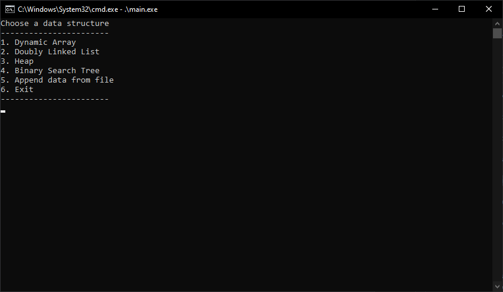
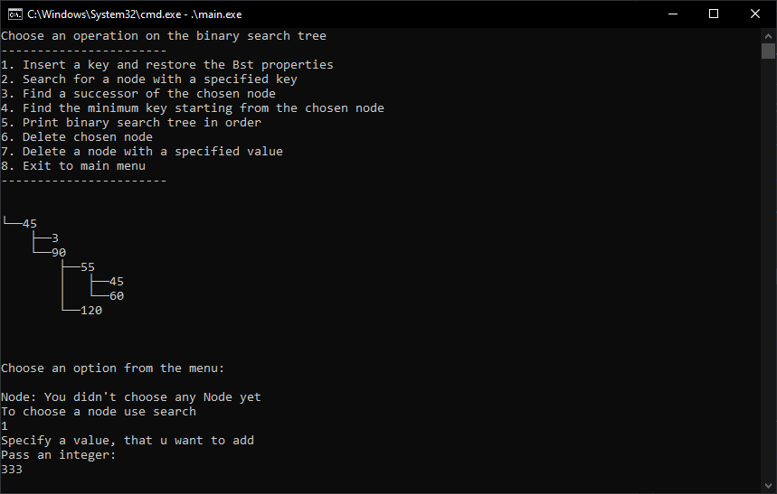
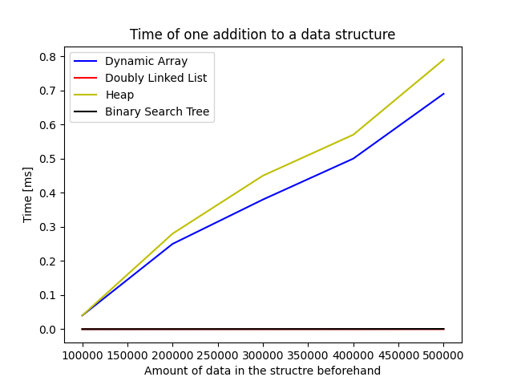

# data_structures_time_analyze 

Implementation of data structures such as: Dynamic Array, Doubly Linked List, Binary Heap and Binary Search Tree in C++

## Application

To run the application firstly compile main.cpp with a C++ compiler. I would suggest using g++ for that, as that's what I've used. For example:

    g++ main.cpp dynamic_array.cpp heap.cpp binary_search_tree.cpp doubly_linked_list.cpp -o main
    
Now you should be able to start the application by simple running the executable:

    .\main.exe
    
## Preview

Main menu:
 
 

 
 
Example BST usage:
 
 

 
 
## Documentation
You can find the documentation in Polish [here](./Documentation.pdf), where I deeply go into the details of time complexities of certain operations on those data structures. You can also find a lot of charts that present the time complexities of addition, substraction and search on the fisnished product.
 
 
Example of a char (Once again you can find more in [here](./Documentation.pdf)):
 
 

